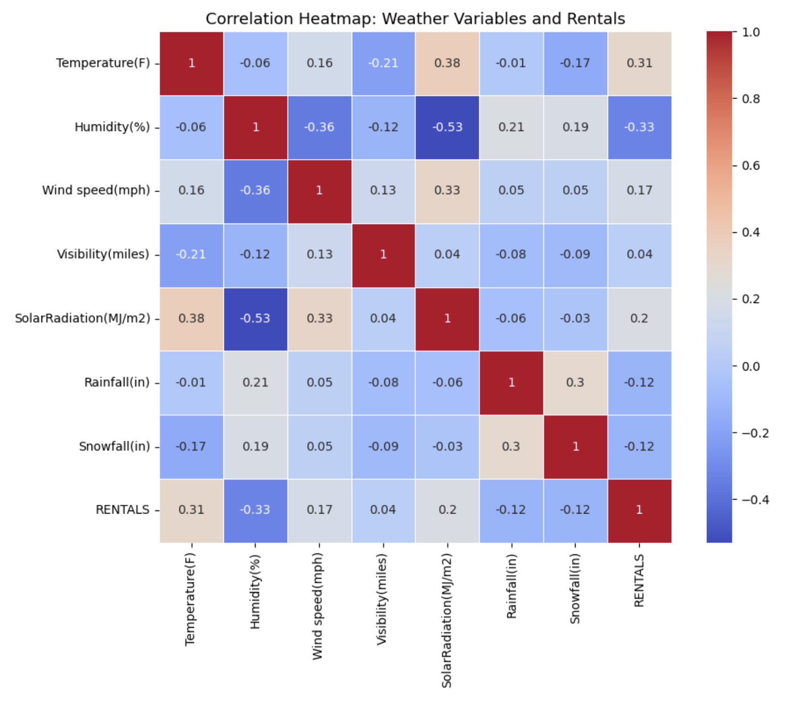
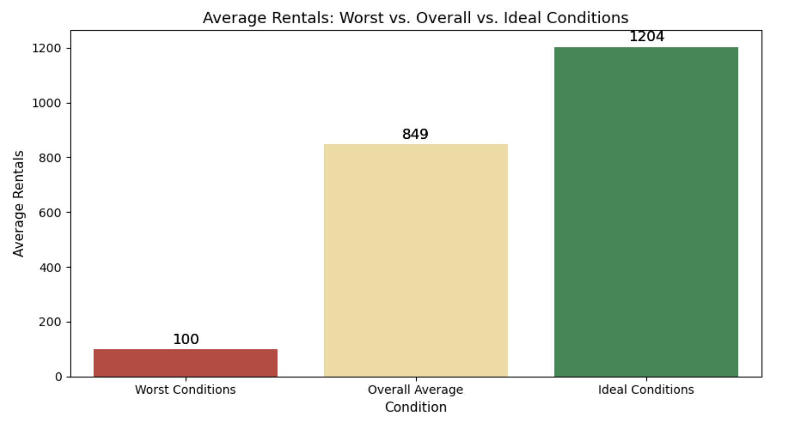

# Bike Rental Demand Analysis

## Overview
This project analyzes hourly bike rental demand using Python and exploratory data analysis techniques. The analysis focuses on commuter behavior, weather impacts, seasonal trends, and operational strategy recommendations.

## Tools & Libraries
- Python
- pandas
- matplotlib
- seaborn
- Jupyter Notebook
- Excel

## Skills Demonstrated
- Exploratory Data Analysis (EDA)
- Data Visualization
- Feature Engineering
- Correlation Analysis
- Business Analytics
- Operational Strategy Interpretation

## Key Findings
- Commute hours account for over 43% of total rentals
- Warm and dry conditions significantly increase demand
- Rainfall and snowfall sharply reduce ridership
- Ideal weather conditions produce approximately 42% more rentals than the dataset average
- Demand declines noticeably as winter approaches

## Business Recommendations
- Improve fleet allocation during peak commute windows
- Implement weather-based pricing strategies
- Increase marketing during favorable fall conditions
- Monitor precipitation forecasts for bike redistribution planning

---

## Visualizations

### Average Rentals by Hour of Day

### Weather Correlation Heatmap

### Worst vs. Overall vs. Ideal Conditions

---

## Files Included
- `Bike_Rental_Demand_Analysis.ipynb`
- `Bike_Rental_Demand_Analysis.html`
- `bikes_data.xlsx`

---

## Author
Jameel Shaikh  
Quantitative Finance | Risk Analytics
