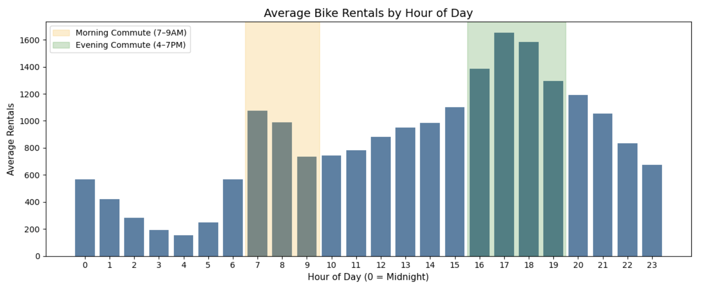
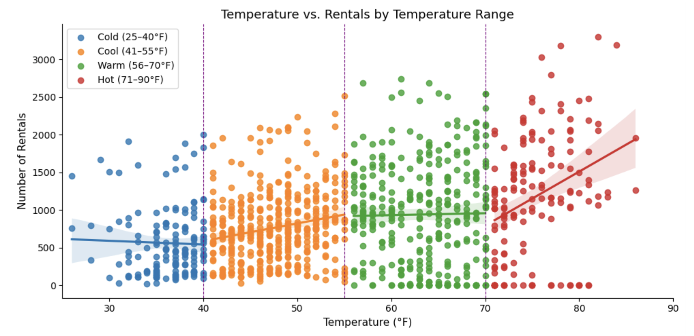
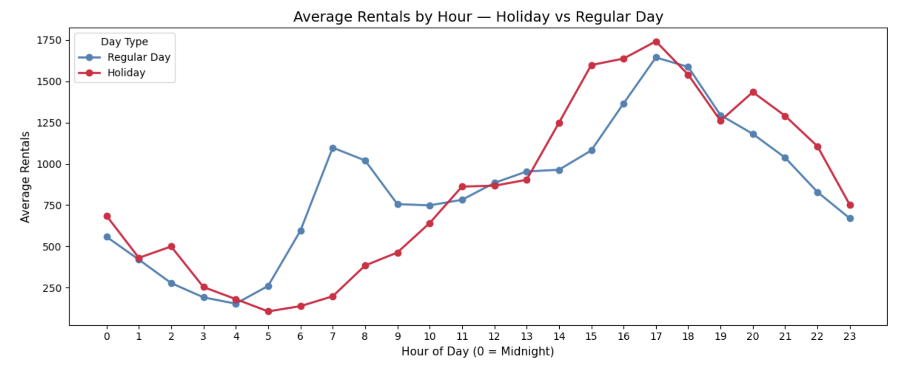

# Bike Rental Demand Analysis

Exploratory Data Analysis and Visualization of Urban Bike Rental Demand Using Python

---

## Project Overview
This project analyzes hourly bike rental demand patterns using Python-based exploratory data analysis (EDA) and data visualization techniques. The objective is to identify how commuter behavior, weather conditions, holidays, and seasonal trends influence bike rental activity.

The analysis combines statistical insights with business-oriented recommendations to better understand operational demand patterns in urban bike-sharing systems.

---

## Quick Access (Google Colab)
Open and run the notebook directly in Google Colab without downloading anything:

> Replace `YOUR_COLAB_LINK_HERE` with your Google Colab notebook link after uploading the notebook to Colab.

---

## Tools & Libraries
- Python
- pandas
- matplotlib
- seaborn
- Jupyter Notebook
- Google Colab
- Excel

---

## Skills Demonstrated
- Exploratory Data Analysis (EDA)
- Data Cleaning & Preparation
- Feature Engineering
- Correlation Analysis
- Statistical Visualization
- Business Analytics
- Operational Strategy Interpretation

---

## Key Findings
- Commute hours account for a significant share of total daily rentals
- Peak rental demand occurs during morning and evening commuter windows
- Warm and dry weather conditions significantly increase ridership
- Rainfall and snowfall sharply reduce rental activity
- Temperature shows a positive relationship with bike demand
- Humidity and precipitation negatively impact ridership levels
- Holiday demand patterns differ noticeably from regular weekdays

---

## Business Recommendations
- Improve fleet allocation during peak commute periods
- Implement weather-responsive operational planning
- Increase bike availability during favorable weather conditions
- Use seasonal demand trends for staffing and redistribution strategies
- Monitor precipitation forecasts for proactive inventory management

---

# Visualizations

## Average Rentals by Hour of Day
This visualization highlights commuter demand behavior and peak rental periods throughout the day.

---

## Temperature vs. Rental Demand Analysis
Relationship between temperature ranges and bike rental activity across varying weather conditions.

---

## Weather Correlation Heatmap
Correlation analysis between weather variables and rental demand.

---

## Holiday vs. Regular Day Rental Patterns
Comparison of hourly rental behavior between holidays and regular days.

---

## Files Included
- `Bike_Rental_Demand_Analysis.ipynb`
- `Bike_Rental_Demand_Analysis.html`
- `bikes_data.xlsx`

---

## Project Focus
This project was developed as part of Python and data analytics practice with a focus on:
- real-world business analytics
- operational decision-making
- visualization storytelling
- commuter demand analysis

---

## Author
**Jameel Shaikh**  
Quantitative Finance | Risk Analytics

GitHub: https://github.com/Jams411  
LinkedIn: https://www.linkedin.com/in/jams411/
